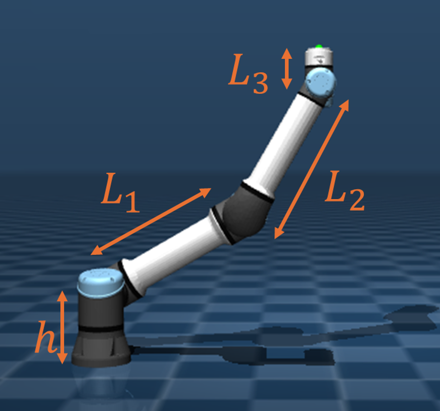
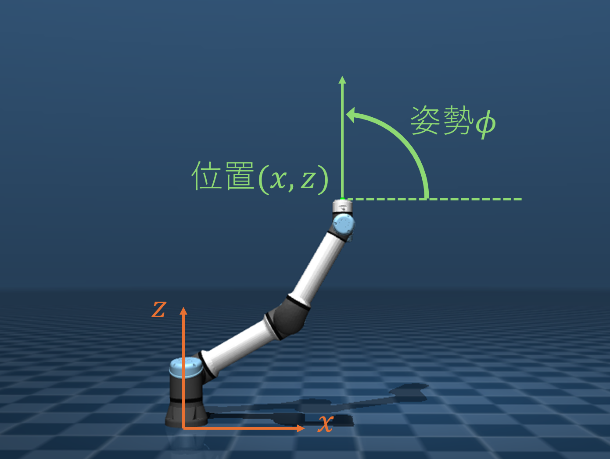
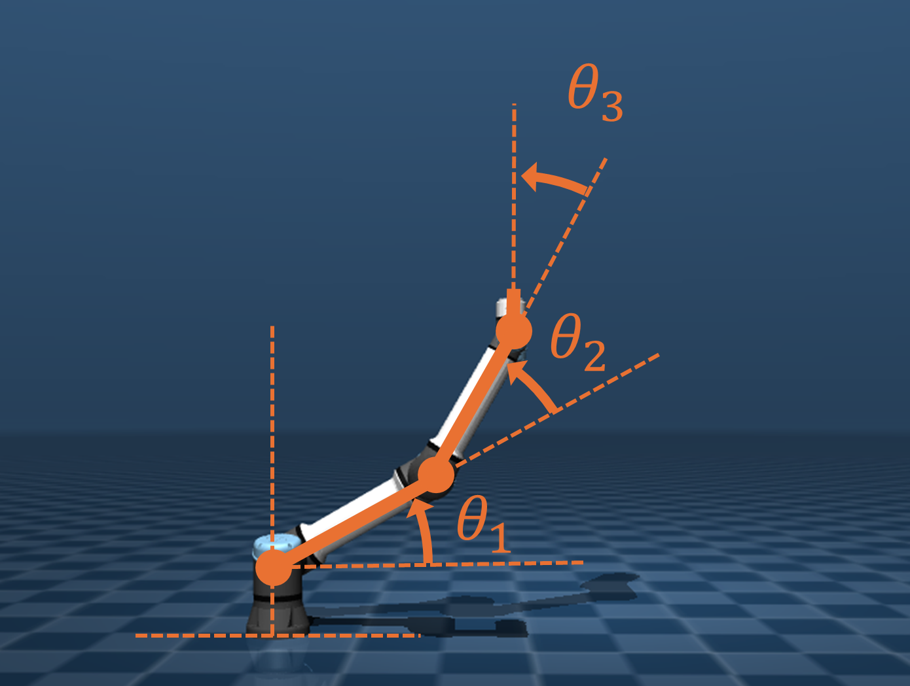
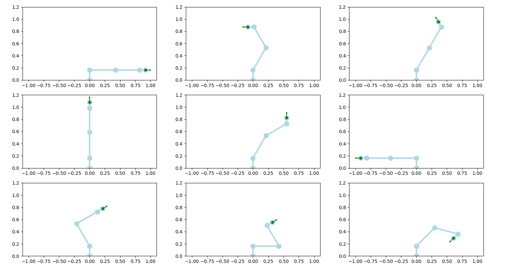
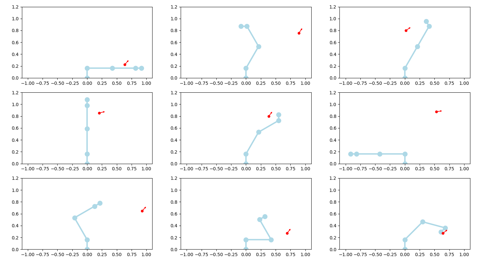
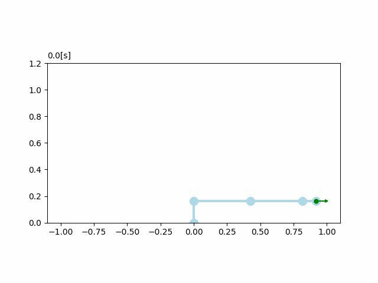
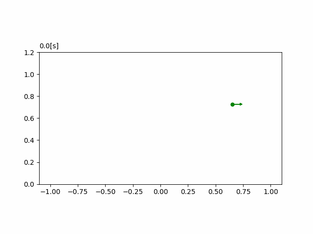

# マニピュレータ勉強会2024

目次
- [マニピュレータ勉強会2024](#マニピュレータ勉強会2024)
  - [ロボットの仕様](#ロボットの仕様)
    - [寸法](#寸法)
    - [手先の位置と姿勢](#手先の位置と姿勢)
  - [Quiz1 順運動学を解こう!](#quiz1-順運動学を解こう)
  - [Quiz2 ヤコビ行列を求めよう!](#quiz2-ヤコビ行列を求めよう)
  - [Quiz3 軌道生成をしよう！](#quiz3-軌道生成をしよう)
  - [Quiz4 制御しよう！](#quiz4-制御しよう)

## ロボットの仕様
### 寸法

~~~
L1 = 0.425
L2 = 0.392
L3 = 0.1
h  = 0.163
~~~

### 手先の位置と姿勢

## Quiz1 順運動学を解こう!

<a href="./Quiz/ForwardKinematics.py">ForwardKinematics.py</a> ↓の部分を考える

関節角度から手先の位置と姿勢を求める

~~~
def ForwardKinematics(theta):
    th1 = theta[0] # 1つ目の関節の角度 [rad]
    th2 = theta[1] # 2つ目の関節の角度 [rad]
    th3 = theta[2] # 3つ目の関節の角度 [rad]
    L1 = 0.425
    L2 = 0.392
    L3 = 0.1
    h = 0.163

    # この部分を考える #######################
    x = "手先のx座標の値"
    z = "手先のz座標の値"
    phi = "手先の姿勢の値"
    #########################################

    return np.array([x, 0.134, z]), phi
~~~

<a href="./Quiz/ForwardKinematics.py">ForwardKinematics.py</a>　を実行
~~~
cd ~/Quiz
python ForwardKinematics.py
~~~

↓みたいにすべての矢印が緑になればOK

↓失敗例

## Quiz2 ヤコビ行列を求めよう!

$ J = \begin{bmatrix}
  \partial x/\partial \theta_{1} & \partial x/\partial \theta_{2} & \partial x/\partial \theta_{3} \\
  \partial z/\partial \theta_{1} & \partial z/\partial \theta_{2} & \partial z/\partial \theta_{3} \\
  \partial \phi/\partial \theta_{1} & \partial \phi/\partial \theta_{2} & \partial \phi/\partial \theta_{3} \\
  \end{bmatrix}$

<a href="./Quiz/Jacobian.py">Jacobian.py</a> ↓の部分を考える

~~~
def Jacobian(theta):
    th1 = theta[0] # 1つ目の関節の角度 [rad]
    th2 = theta[1] # 2つ目の関節の角度 [rad]
    th3 = theta[2] # 3つ目の関節の角度 [rad]
    L1 = 0.425
    L2 = 0.392
    L3 = 0.1
    
    J = np.zeros(shape=(3,3))
    # ここを考える #######################################
    J[0,0] = 0
    J[0,1] = 0
    J[0,2] = 0
    
    J[1,0] = 0
    J[1,1] = 0
    J[1,2] = 0
    
    J[2,0] = 0
    J[2,1] = 0
    J[2,2] = 0
    ########################################################
    return J
~~~

<a href="./Quiz/Jacobian.py">Jacobian.py</a> を実行
~~~
cd ~/Quiz
python Jacobian.py
~~~

Quiz/gifにJacobian_check.gifが保存される

↓成功例

↓失敗例

## Quiz3 軌道生成をしよう！

<a href="./Quiz/Trajectory.py">Trajectory.py</a> ↓の部分を考える

x,z,phi(任意)を時刻 t[s] の関数で表す。
~~~
def Target(t):
    
    # 初期位置・姿勢
    init_x = 0.65198196      
    init_z = 0.7270608
    init_phi = 0
    
    # ここを考える #################
    # x,z,phi(任意)を時刻 t[s] の関数で表す。
    x = init_x
    z = init_z
    phi = init_phi
    ###############################
    
    return np.array([x, 0.134, z]), phi
~~~

<a href="./Quiz/Trajectory.py">Trajectory.py</a>　を実行
~~~
cd ~/Quiz
python Trajectory.py
~~~

Quiz/gifにTrajectory_check.gifが保存される

## Quiz4 制御しよう！

<a href="./Quiz/Control.py">Control.py</a> ↓の部分を考える

ゲインを調整していい感じに動かそう！

~~~
def Control(t, theta, d_theta):
    # ゲインを調整#########
    Kp = 0
    Kd = 0
    ######################
    
    
    pos,phi = ForwardKinematics(theta) #Quiz1 で作成した関数
    J = Jacobian(theta)                #Quiz2 で作成した関数
    target_pos, target_phi = Target(t) #Quiz3 で作成した関数
    
    diff_pos = target_pos - pos
    diff_phi = target_phi - phi
    
    
    torque = Kp*(J.T @ np.array([diff_pos[0],diff_pos[2], diff_phi])) - Kd* d_theta
    
    return torque, target_pos, target_phi
~~~

<a href="./Quiz/Control.py">Control.py</a> を実行
~~~
cd ~/Quiz
python Control.py
~~~

「左クリック」でカーソルを動かすとカメラの向きを変えることができる
「alt+左クリック」でカーソルを動かすとカメラの位置を変えることができる
