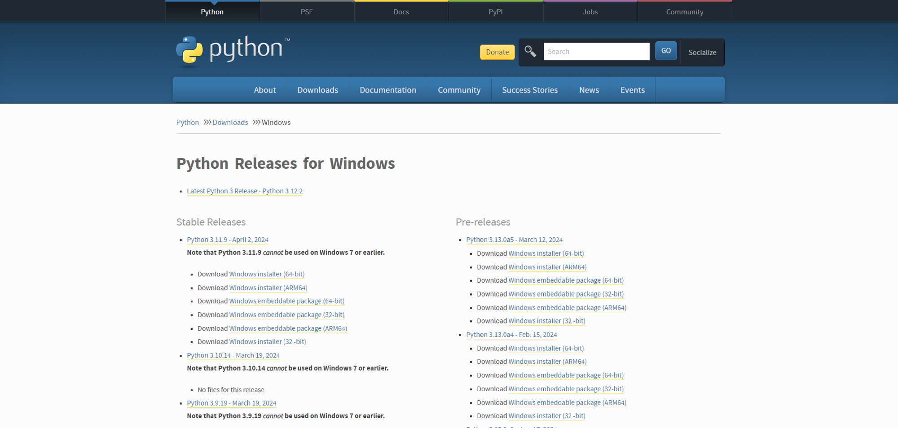
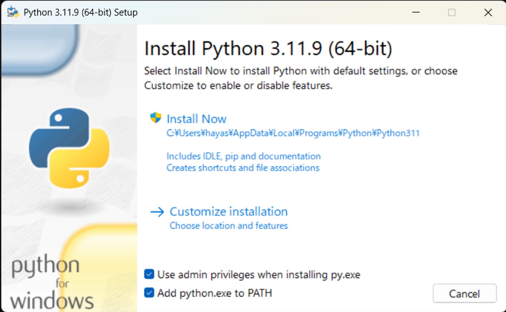
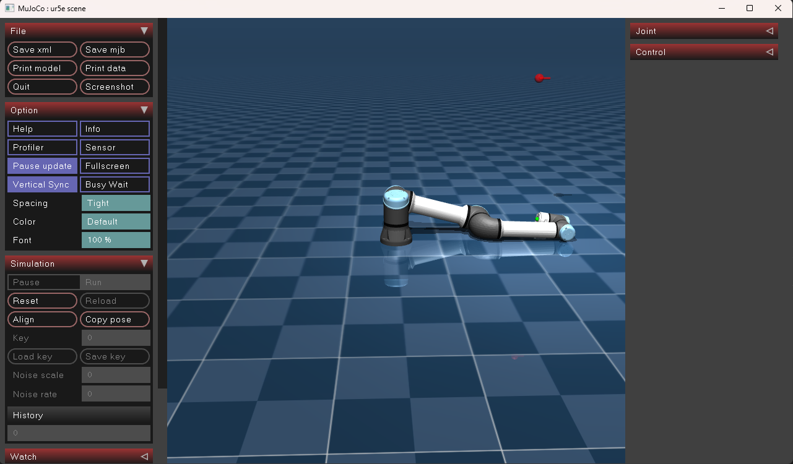

# 環境構築

目次
- [環境構築](#環境構築)
    - [Pythonをインストール](#Pythonをインストール)
    - [作業ディレクトリの作成](#作業ディレクトリの作成)
    - [仮想環境の作成](#仮想環境の作成)
    - [仮想環境のActivate](#仮想環境のActivate)
    - [必要なライブラリのインストール](#必要なライブラリのインストール)
    - [動作確認](#動作確認)

## Pythonをインストール

※すでに、PythonやAnacondaが入っている人は飛ばしてください

公式サイトからダウンロード
https://www.python.org/downloads/windows/

Download Windows installer (64-bit)

Add python.exe to PATH にチェック

インストール後再起動

## 作業ディレクトリの作成

ターミナル（コマンドプロンプト）を開く
※PowerShellだとうまくいかないかも
好きなところに作業ディレクトリを作る（名前は何でも可）
~~~
mkdir workspace
~~~

最終的に↓のようにしたい
~~~
- workspace (作業ディレクトリ)
    - env (Pythonの仮想環境)
    - Quiz
~~~

## 仮想環境の作成

### Pythonの場合
作業ディレクトリに移動し、仮想環境を作る
~~~
cd workspace
python -m venv 環境名
~~~

### Anacondaの場合
~~~
conda create -n 環境名 python=3.11.9
~~~

## 仮想環境のActivate

### Pythonの場合
作業ディレクトリで↓を実行
~~~
環境名\Scripts\activate
~~~

### Anacondaの場合
~~~
conda activate 環境名
~~~

## 必要なライブラリのインストール
mujocoとmatplotlibをインストール
~~~
pip install mujoco matplotlib
~~~

##  動作確認 

Quiz ディレクトリをそのまま自分の環境にコピー

Control.py を実行
~~~
cd ~/Quiz
python Control.py
~~~

↓の画面が表示されたら完了

