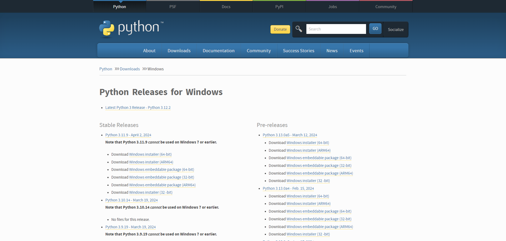
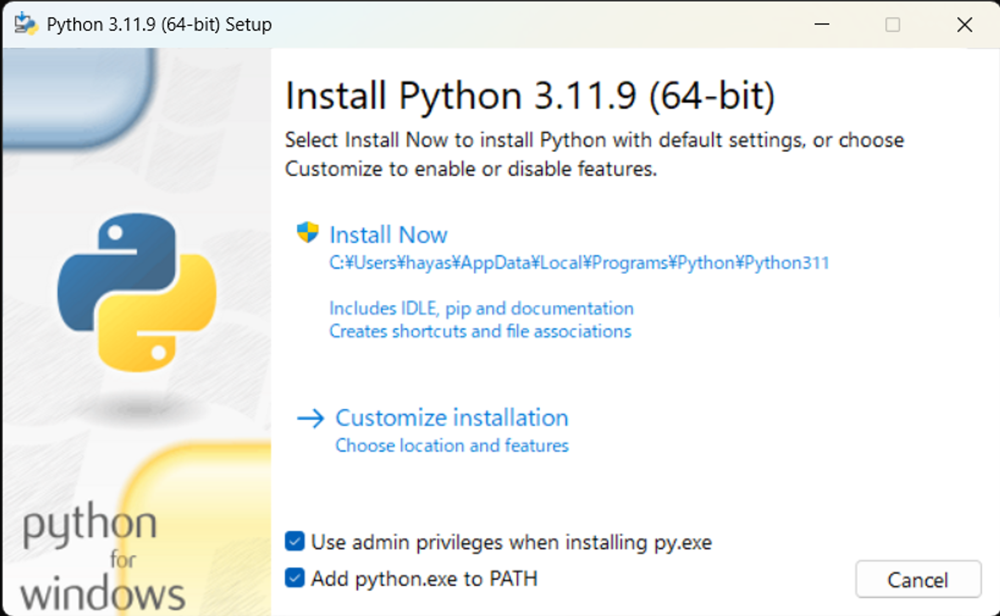

# 環境構築

## Install Python

https://www.python.org/downloads/windows/

Download Windows installer (64-bit)

Add python.exe to PATH にチェック

インストール後再起動

## 作業ディレクトリの作成
~~~
mkdir workspace
~~~

## 仮想環境の作成
~~~
cd workspace
python -m venv manipulator
~~~

## Activate
~~~
env\Scripts\activate
~~~

## Install Mujoco

~~~
pip install mujoco
~~~